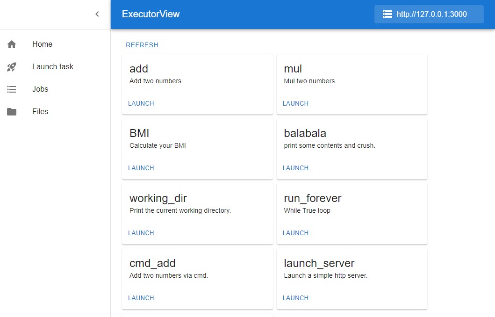

<div align="center">
<h1> Executor View 🌐 </h1>

<p> The web frontend for <a href="https://github.com/Nanguage/executor-http">Executor HTTP</a> </p>

<p>
  <a href="https://github.com/Nanguage/executor-http/actions/workflows/build_and_test.yml">
      
  </a>
  <a href="https://github.com/Nanguage/executor-view/blob/master/LICENSE">
    
  </a>
  <a href="https://nanguage.github.io/executor-view/">
    <image src="https://img.shields.io/badge/demo-online-8A2BE2">
  </a>
</p>
</div>

## 📖 Introduction

Executor View is the web frontend for [Executor HTTP](https://github.com/Nanguage/executor-http).
It's provided a web interface for users to submit, monitor, and manage jobs for the executor-http server.



### Specify server address via URL

You can specify the server address via URL, for example:

```
https://nanguage.github.io/executor-view/?server=http://localhost:3000
```

## 🔗 Related Projects

- [executor-engine](https://github.com/Nanguage/executor-engine): Effortless, flexible, and powerful job execution engine.
- [executor-http](https://github.com/Nanguage/executor-http): HTTP server and client for executor engine.
